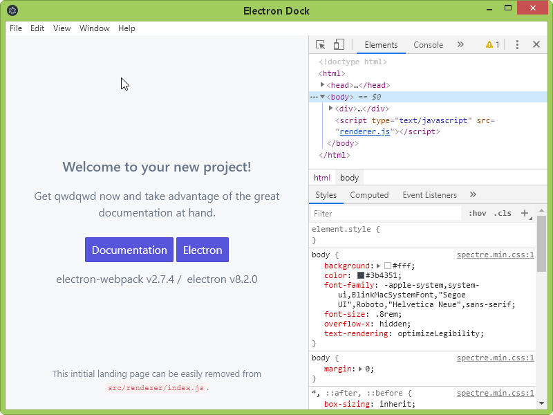

#Electron Builder

Они рекомендуют Yarn. Но проект отлично работает и в NPM

Renderer.sourceDirectory can be null.

- Config
    - [Config electron-webpack.json](doc/ConfigElectronWebpack.md)
    - [Config webpack](doc/ConfigWebpack.md)

- Other
    - [Hot reload](doc/Yarn.md)
    - [Yarn](doc/HotReload.md)

